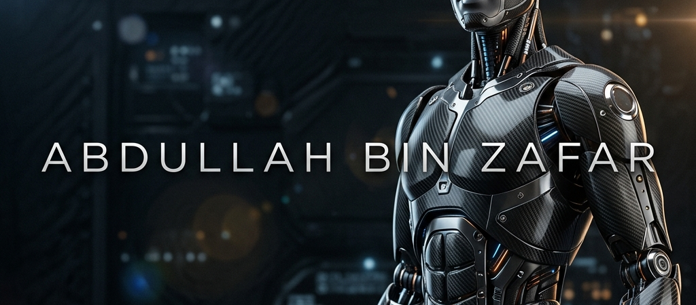

<!-- 
      ABDULLAH BIN ZAFAR — ELITE GITHUB PROFILE (FULL DATA RESTORED)
      Mechatronics × Robotics × Embedded Systems × AI
-->

<!-- WIDE CINEMATIC BANNER -->

 

 

## 🌐 &nbsp;EXECUTIVE PROFILE (RESTORED)

> Final-year **Mechatronics & Control Engineering** undergraduate at **UET Lahore — Faisalabad Campus** (Expected 2027) with a proven track record of building physical hardware prototypes for *every single laboratory module* across 5 semesters. Uniquely full-stack across the complete mechatronics discipline: ROS/ROS2 robotics, STM32/ESP32 embedded systems, OpenCV computer vision, MATLAB/Simulink control design, SolidWorks & AutoCAD CAD/CAM, KiCad PCB design, and PLC industrial automation. Certified in Generative AI (Google, IBM, Microsoft) and SolidWorks. Actively learning Mandarin Chinese. **Seeking a fully funded global internship — with strong preference for China — to contribute to cutting-edge robotics and automation R&D.**

| 🎓 University | 📊 Metrics | 🏆 Academic Performance |
| :--- | :--- | :--- |
| **UET Lahore (FSD Campus)** | **CGPA:** 3.0 / 4.0 | **15+** A / A+ Grades |
| B.Sc. Mechatronics & Control | **Semester:** 6th (Reg: 2023-MC-292) | **0** Missed Lab Builds |

 

---

## ⚙️ &nbsp;TECHNICAL ARSENAL

  

 

### 🧠 &nbsp;Premium AI & Generative Models

  
  
  
  
   
  
  

 

| **Domain** | **Technologies & Skills** |
| :--- | :--- |
| 🧠 **Generative AI & LLMs** | Prompt Engineering, RAG, AI Agents, Vector DBs (Pinecone) |
| 🤖 **Robotics & AI** | ROS / ROS2, PID Control, Roboanalyzer, 6-DOF Kinematics |
| ⚡ **Embedded Systems** | STM32, Arduino, ESP32, I²C, SPI, UART, CAN Bus, PWM |
| 💻 **Programming** | C / C++, Python, MATLAB, Simulink, Java, TypeScript |
| 🎨 **CAD / CAM / PCB** | SolidWorks (Certified), AutoCAD, KiCad, CNC Milling, G-code |

---

## 🚀 &nbsp;ROBOTICS & HARDWARE PROJECTS (RESTORED)

  

| Project | Hardware / Software | Key Achievements |
| :--- | :--- | :--- |
| 🦾 **1-DOF Robotic Arm** | STM32, SolidWorks, MATLAB | CNC-machined. Closed-loop PID per joint. ±0.5mm repeatability. |
| 🚁 **Autonomous Drone** | ESP32, MPU-6050, OpenCV | Sensor Fusion (IMU + Optical). OpenCV line detection. |
| 🚗 **Line-Following UAV** | Arduino, IR/Camera Sensors | High-speed path tracking, custom PCB chassis integration. |
| 🐜 **Ant Robot** | Custom Servos, Kinematics | Hexapod gait generation, inverse kinematics. |
| ⚙️ **3-DOF Arm** | CAD/CAM, Inverse Kinematics | Designed and simulated a multi-axis manipulator. |

 

---

## 🔬 &nbsp;LABORATORY PROTOTYPING PORTFOLIO

*Hardware Built For Every Module across 5 Semesters:*

*   ⚙️ **Robotics:** Multi-link kinematic synthesis & spatial mechanisms.
*   💨 **Hydraulics & Pneumatics:** Automated pneumatic door system.
*   🔌 **Embedded Systems:** STM32/Arduino I²C/SPI polling, PWM motor control.
*   ⚡ **Electrical Machinery:** Fabricated complete AC/DC regulated power supply.
*   🏗️ **Engineering Mechanics:** Foldable load-bearing desk with complex hinge.

---

## 📊 &nbsp;GitHub Intelligence

 

<picture>
  <source media="(prefers-color-scheme: dark)" srcset="https://raw.githubusercontent.com/EngineerAbdullahBinZafar/EngineerAbdullahBinZafar/output/github-snake-dark.svg" />
  <source media="(prefers-color-scheme: light)" srcset="https://raw.githubusercontent.com/EngineerAbdullahBinZafar/EngineerAbdullahBinZafar/output/github-snake.svg" />
  
</picture>

---

## 🏆 &nbsp;Achievement Trophies

---

## 🌐 &nbsp;Connect With Me

&nbsp;

&nbsp;

 

  

